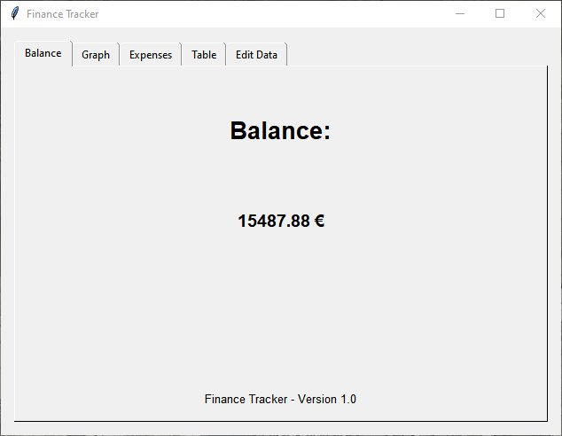
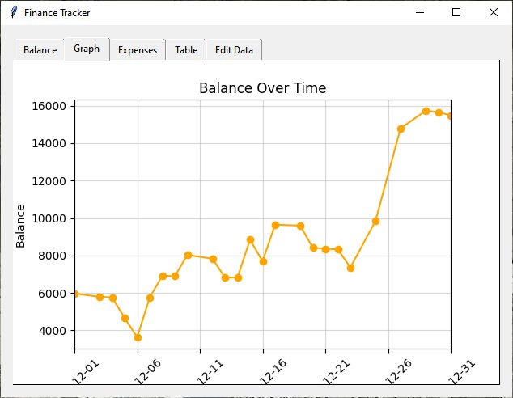
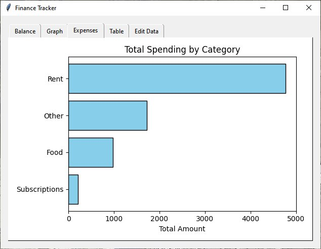
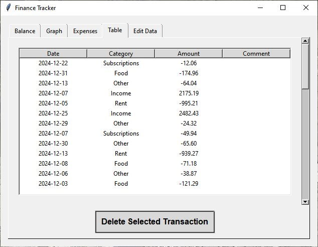
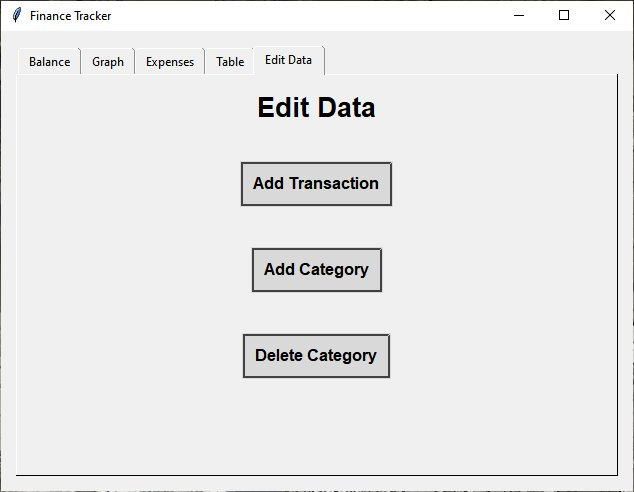
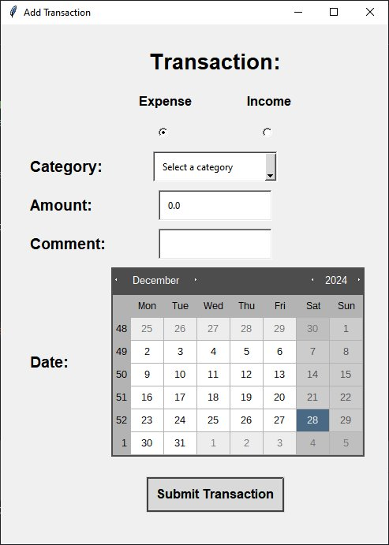
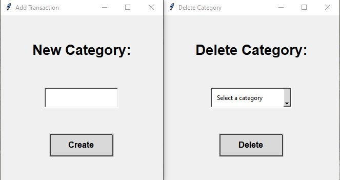

# Finance Tracker
Finance Tracker is a user-friendly desktop application that helps you manage your finances by tracking income, expenses, and categories. It provides a clear overview of your financial activities with visualizations, tabular data, and category-based tracking.

## Features
- **Track Income and Expenses**: Easily add income and expense transactions with comments, categories, and dates.
- **Dynamic Visualizations**:
  - View your daily financial trends with line plots.
  - Analyze expense distribution using bar charts.
- **Editable Transactions**: Add or delete transactions directly from the interface.
- **Category Management**: Create and delete custom categories for better expense classification.
- **Tabular Overview**: View all transactions in an organized table with sorting capabilities.

## Screenshots








## Installation
### Prerequisites
- Python 3.9 or later
- Required libraries:
  - `tkinter`
  - `pandas`
  - `tkcalendar`
  - `matplotlib`
  - `sqlite3` (built into Python)
### Steps
1. Clone this repository:
    ```bash
    git clone https://github.com/yourusername/finance-tracker.git
    cd finance-tracker
    ```

2. Install the dependencies:
    ```bash
    pip install -r requirements.txt
    ```

3. Run the application:
    ```bash
    python main.py
    ```

## Usage
1. Launch the application using the command above.
2. Navigate through the tabs:
   - **Balance**: View your total financial balance.
   - **Graph**: Check your financial trends over time.
   - **Expenses**: Analyze your spending patterns by category.
   - **Table**: Review all transactions in a sortable table.
   - **Edit Data**: Add or delete transactions and manage categories.
3. Add transactions via the "Add Transaction" button, filling in details like type, category, amount, comment, and date.
4. Customize categories under the "Edit Data" tab.

## Directory Structure

```bash
finance-tracker/
├── main.py                # Main application file
├── helper_database.py     # Database helper for transaction and category management
├── helper_plot.py         # Helper functions for generating graphs
├── requirements.txt       # List of dependencies
└── README.md              # Documentation file
```
## Database Structure
- **Categories**: Stores user-defined categories.
- **Transactions**: Tracks income and expenses with:
  - Date
  - Category
  - Amount
  - Comment

## Contributing
1. Fork the repository.
2. Create a new branch:
    ```bash
    git checkout -b feature-name
    ```
3. Commit your changes:
    ```bash
    git commit -m "Add your message here"
    ```
4. Push to the branch:
    ```bash
    git push origin feature-name
    ```
5. Create a pull request.

## License
This project is licensed under the MIT License.

## Acknowledgements
- **Tkinter**: For providing the GUI framework.
- **Matplotlib**: For visualizing data.
- **Pandas**: For handling and manipulating data.
- **SQLite**: For the lightweight database.

## Contact
For questions or feedback, please reach out to eikehanel@gmail.com.